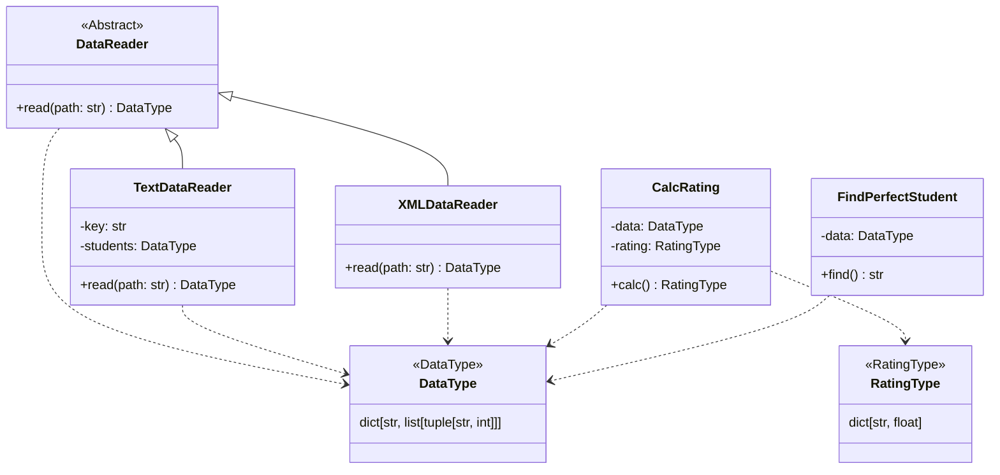

# Лабораторная работа 1 по дисциплине "Технологии программирования"

## Описание проекта
Проект для расчета среднего рейтинга студентов и поиска студентов с идеальными оценками.

## Функциональность
- Чтение данных из текстовых файлов (TextDataReader)
- Чтение данных из XML файлов (XMLDataReader) 
- Расчет среднего рейтинга студентов (CalcRating)
- Поиск студентов с 100 баллами по всем предметам (FindPerfectStudent)

## UML-диаграмма классов



## Структура проекта

rating/

├── src/                    # Исходный код
│   ├── DataReader.py      # Абстрактный класс для чтения данных
│   ├── TextDataReader.py  # Чтение из текстовых файлов
│   ├── XMLDataReader.py   # Чтение из XML файлов
│   ├── CalcRating.py      # Расчет рейтинга 
│   ├── FindPerfectStudent.py # Поиск отличников
│   ├── Types.py           # Типы данных
│   └── main.py            # Главная программа
├── test/                  # Тесты
├── data/                  # Тестовые данные
├── docs/                  # Документация
└── .github/workflows/     # GitHub Actions


## Используемые технологии
- Python 3.10
- pytest для тестирования
- Git для контроля версий
- GitHub Actions для CI/CD
- XML parsing для работы с XML

## Запуск проекта
```bash
# Установка зависимостей
pip install -r requirements.txt

# Запуск тестов
pytest test

# Запуск с текстовым файлом
python src/main.py -p data/data.txt

# Запуск с XML файлом
$env:PYTHONPATH = "D:\rating"
python src/main.py -p data/test_data.xml -f xml
